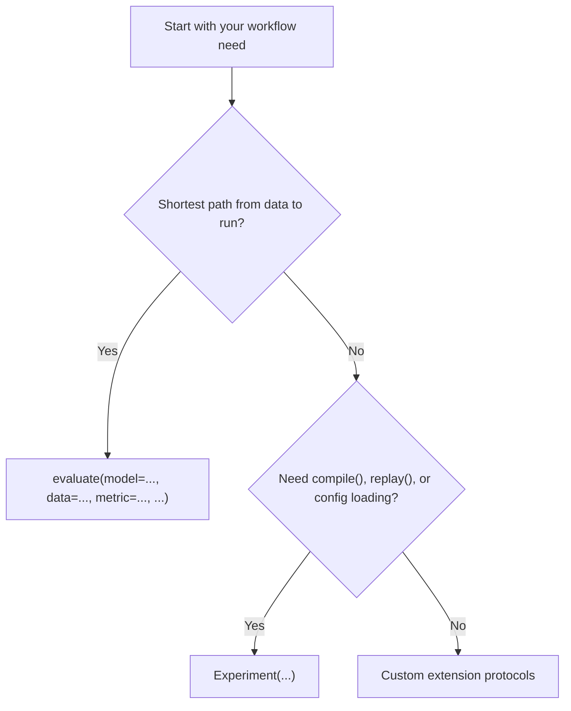

# Choose your API layer

Use `evaluate(model=..., data=..., metric=..., ...)` when you want the shortest path from a dataset and a few inline arguments to a completed run. It is best for quick scripts and quick local experiments.

Use `Experiment(...)` when you want an explicit compiled object, access to `compile()`, `run()`, `replay()`, config-file loading, or long-lived experiment definitions. This is the primary surface for most serious work.

Use custom extension protocols when builtin generators, parsers, reducers, or metrics are not sufficient and you need to plug your own behavior into the runtime.

Use this chooser when you need the smallest surface that still exposes the behavior you care about.

All three paths still converge on the same runtime model, so this choice is about authoring surface, not a different engine.

## Decision rule

| Option | Best for | Persistence / runtime behavior | Caveats |
| --- | --- | --- | --- |
| `evaluate(model=..., data=..., metric=..., ...)` | The shortest path from inline data to a completed run | Uses the same runtime under a smaller authoring surface | Less explicit control over compile, replay, and config loading |
| `Experiment(...)` | Reusable experiment definitions and long-lived workflows | Exposes compile, replay, config loading, and store control | More structure than a one-off script |
| Extension protocols | Custom runtime behavior when builtins are not enough | Still plugs into the same Themis runtime once implemented | Requires custom code and protocol knowledge |

Next:

- learn by example in [First `evaluate(...)`](../tutorials/first-evaluate.md)
- understand the model in [API layer model](../explanation/api-layer-model.md)
