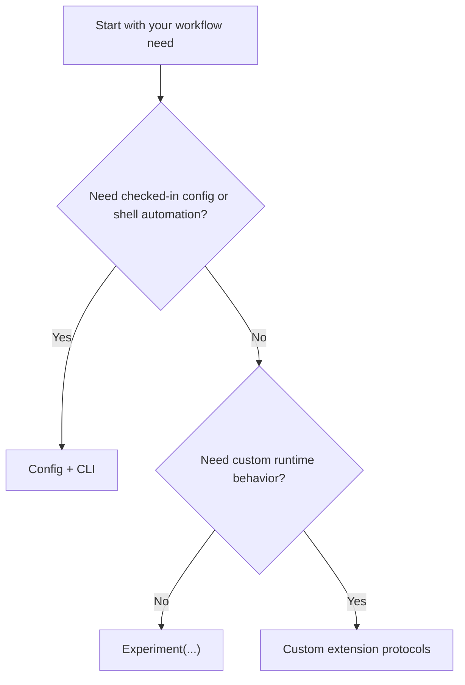

# Choose your API layer

Use `Experiment(...)` when you want an explicit compiled object, access to `compile()`, `run()`, `replay()`, config-file loading, or long-lived experiment definitions. This is the primary surface for most serious work.

Use config and CLI commands when you want checked-in experiment definitions, shell-friendly automation, or deferred worker and batch execution.

Use custom extension protocols when builtin generators, parsers, reducers, or metrics are not sufficient and you need to plug your own behavior into the runtime.

Use this chooser when you need the smallest surface that still exposes the behavior you care about.

```mermaid
flowchart TD
    A["Start with your workflow need"]
    A --> B{"Need checked-in config or shell automation?"}
    B -->|Yes| C["Config + CLI"]
    B -->|No| D{"Need custom runtime behavior?"}
    D -->|No| E["Experiment(...)"]
    D -->|Yes| F["Custom extension protocols"]
```

All three paths still converge on the same runtime model, so this choice is about authoring surface, not a different engine.

## Decision rule

| Option | Best for | Persistence / runtime behavior | Caveats |
| --- | --- | --- | --- |
| `Experiment(...)` | Reusable Python-authored runs and local debugging | Exposes compile, replay, config loading, and store control | More explicit structure than the removed one-call helper |
| Config + CLI | Checked-in experiment specs and automation | Shell-friendly execution through `themis run`, `submit`, `worker`, and `batch` | Component references must be importable or builtin ids |
| Extension protocols | Custom runtime behavior when builtins are not enough | Still plugs into the same Themis runtime once implemented | Requires custom code and protocol knowledge |

Next:

- learn by example in [First `Experiment(...)`](../tutorials/first-experiment.md)
- understand the model in [API layer model](../explanation/api-layer-model.md)
