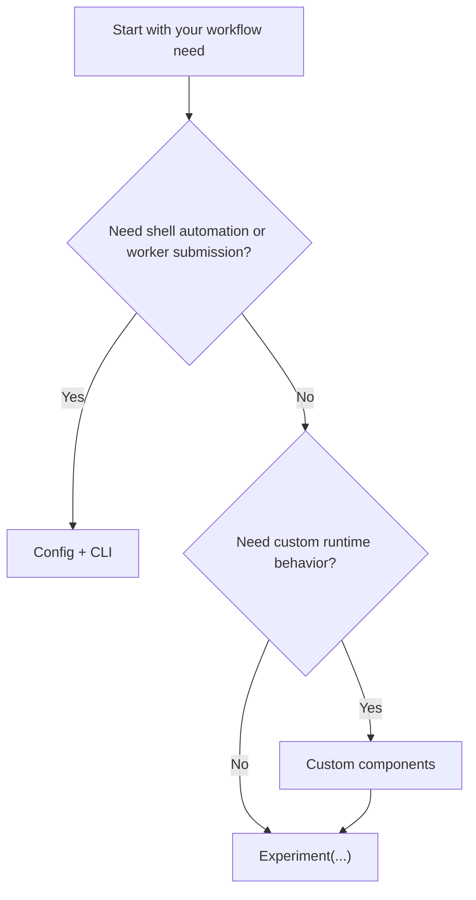

# Choose your API layer

Use `Experiment(...)` from reviewed Python modules when you want an explicit compiled object, access to `compile()`, `run()`, `replay()`, or long-lived experiment definitions. This is the canonical surface for serious experiment meaning.

Use config and CLI commands when you want shell-friendly automation, environment-specific overrides, or deferred worker and batch execution around config-loadable Python definitions and components.

Use custom extension protocols when builtin generators, parsers, reducers, or metrics are not sufficient and you need to plug your own behavior into the runtime.

Use this chooser when you need the smallest surface that still exposes the behavior you care about.

```mermaid
flowchart TD
    A["Start with your workflow need"]
    A --> B{"Need shell automation or worker submission?"}
    B -->|Yes| C["Config + CLI"]
    B -->|No| D{"Need custom runtime behavior?"}
    D -->|No| E["Experiment(...)"]
    D -->|Yes| F["Custom components"]
    F --> E
```

All three paths still converge on the same runtime model, so this choice is about authoring surface, not a different engine.

## Decision rule

| Option | Best for | Persistence / runtime behavior | Caveats |
| --- | --- | --- | --- |
| `Experiment(...)` | Reusable Python-authored experiment definitions and local debugging | Exposes compile, replay, and store control | Canonical surface for serious experiment meaning |
| Config + CLI | Automation, overrides, worker submission, and batch execution | Shell-friendly execution through `themis run`, `submit`, `worker`, and `batch` | Automation surface only; component references must be importable or builtin ids |
| Extension protocols | Custom behavior when builtins are not enough | Components plug into `Experiment`; they are not a separate authoring format | Requires custom code and protocol knowledge |

Next:

- learn by example in [First `Experiment(...)`](../tutorials/first-experiment.md)
- understand the model in [API layer model](../explanation/api-layer-model.md)
