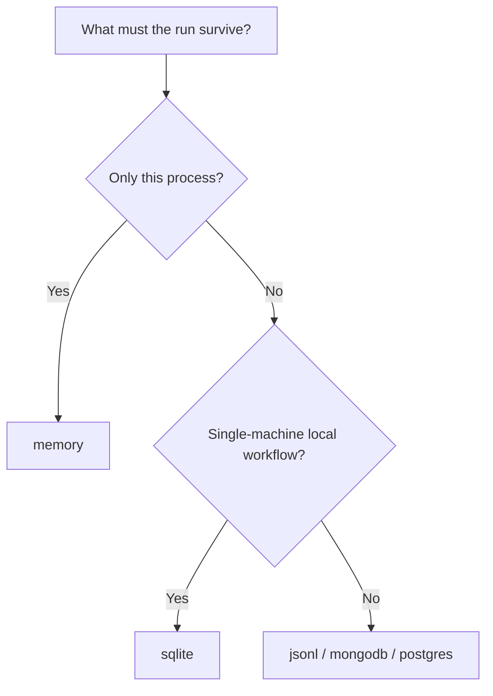

# Choose your storage backend

Use `memory` when you want the smallest local run and you do not need to reopen the run from another process.

Use `sqlite` when you want persisted runs, later reporting, resume across processes, or a default local backend that works well for most single-machine workflows.

Use `jsonl`, `mongodb`, or `postgres` when you have a specific operational requirement that makes those stores a better fit than SQLite.

Use this chooser when persistence and later inspection matter more than the scoring logic itself.

The decision is mostly about whether later resume, reporting, or handoff must happen outside the current process.

## Decision rule

| Option | Best for | Persistence / runtime behavior | Caveats |
| --- | --- | --- | --- |
| `memory` | Tutorials and smoke tests | Keeps artifacts only in the current process | No cross-process reopen, report, or cache reuse |
| `sqlite` | Most real local work | Persists runs locally for resume, report, compare, and export | Less environment-specific flexibility than external stores |
| External stores | Operational or integration-specific needs | Match non-local persistence requirements such as services or shared infrastructure | More setup and backend-specific operational work |

Next:

- [First persisted run](../tutorials/first-persisted-run.md)
- [Choose the right store backend](../how-to/choose-the-right-store-backend.md)
- [Store backend model](../explanation/store-backend-model.md)
