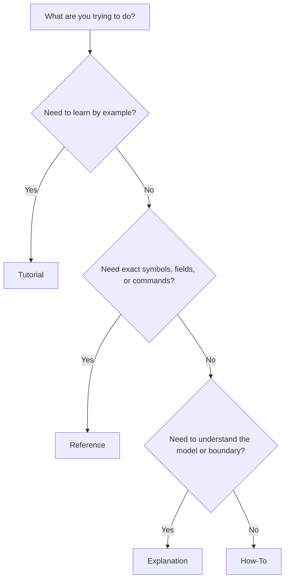

# Route by goal

Use this page when you know what you want to accomplish but not which quadrant to read.

Use this decision tree to turn your immediate goal into the right document type.

Once you know the quadrant, the links below should get you to the right page without translating concepts yourself.

- Run the smallest possible evaluation: [First `evaluate(...)`](../tutorials/first-evaluate.md)
- Decide whether to use Python or config and CLI: [Run from Python vs config and CLI](../how-to/run-from-python-vs-config-and-cli.md)
- Configure a provider-backed generator: [Configure generators](../how-to/configure-generators.md)
- Author custom components: [Author custom components](../how-to/author-custom-components.md)
- Persist, inspect, or rejudge runs: [Reproduce and rejudge runs](../how-to/reproduce-and-rejudge-runs.md)
- Understand `run_id`: [Identity vs provenance](../explanation/identity-vs-provenance.md)
- Look up exact fields or symbols: [Reference overview](../reference/index.md)
