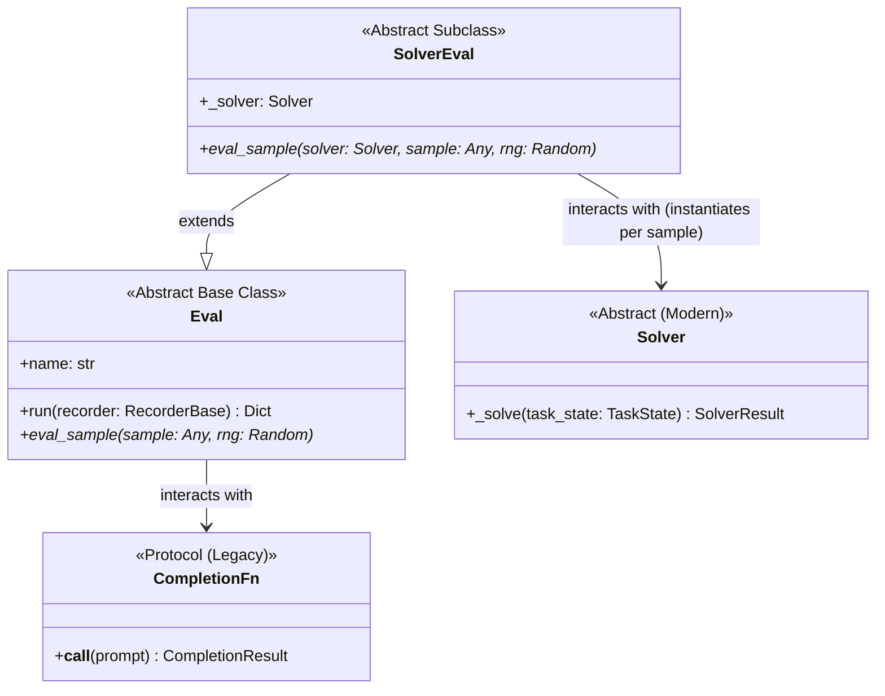
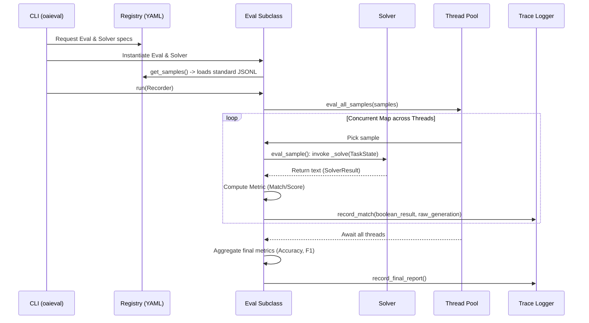

# Engineering Handoff: OpenAI Evals Architecture & Integration Guide

This document is intended for the internal LLM Research and Engineering team. It provides a technical teardown of the `openai/evals` framework, analyzing its architecture, integration points, and suitability as a foundational evaluation harness for our internal work.

---

## 1. Executive Summary & Adoption Verdict

**What is it?** A highly parallelized, registry-driven evaluation framework designed to benchmark LLMs using both deterministic string matching and LLM-as-a-judge (Model-Graded) techniques.

**Why consider it?** It elegantly separates the concern of defining an evaluation from the concern of integrating a model. This enables cross-functional teams (Engineers, Researchers, PMs) to collaborate on safety and capability metrics within a single repository via YAML and JSONL.

### 1.1 Organizational Strengths

**From an Engineering Perspective:**
*   **Infrastructure Ready:** Native `ThreadPool` execution scales out I/O-bound API calls efficiently, running hundreds of samples concurrently with minimal scaffolding.
*   **Structured Telemetry:** The `RecorderBase` enforces a schema-on-write logging strategy. Every run logs the `prompt`, `sampled`, `expected`, `picked`, and match status. Native support for SQLite, JSONL, and Snowflake provides high auditability.
*   **Extensible Abstract Base Classes:** By subclassing `Solver`, engineers can build generic wrappers for virtually any local (vLLM, TRT-LLM) or remote (Anthropic, internal API) model endpoints seamlessly.
*   **Encapsulation of State:** The new `Solver` design instantiates a fresh class per sample, cleanly avoiding cross-thread state pollution (e.g., memory bugs during multi-turn evals).

**From a Research Perspective:**
*   **Zero-Code Evaluation Setup:** Researchers, SMEs, and data scientists can define complex new evaluations, tune prompts, and specify datasets purely in YAML and JSONL—without needing software engineering resources.
*   **First-Class Model-Graded Evals:** Out-of-the-box support for "LLM-as-a-judge." Complex metrics like factual consistency or conciseness can be tested quickly using pre-built qualitative grading templates (e.g., `ModelBasedClassify`).
*   **Reproducibility via Seed Management:** The pipeline natively shuffles and indexes datasets predictably via deterministic random seeding (e.g., `SHUFFLE_SEED`), making experiments reproducible.

### 1.2 Known Limitations & Workarounds

**From an Engineering Perspective:**
*   **OpenAI-Centric Legacy:** The framework fundamentally expects OpenAI-formatted `messages` or simple strings. Wrapping custom APIs or local models requires writing and maintaining `CompletionFn` or `Solver` adapters.
*   **Debugging Friction:** The framework dynamically loads classes from string references inside YAML files. When an evaluation fails (e.g., malformed template or buggy solver), static analysis tools will not trace it, and the Python stack traces obfuscate the true origin of the crash.
*   **Monolithic Flow:** It assumes a strictly synchronous `Task -> Generate -> Score -> Log` pipeline. It is difficult to adapt for asynchronous workflows, long-running agentic tasks (requiring manual resume), or multi-day human-in-the-loop (RLHF) panel reviews.

**From a Research Perspective:**
*   **Data Management Tax:** The heavy reliance on **Git-LFS** for dataset tracking scales poorly if we intend to run sweeping tests against gigabytes of proprietary internal data (e.g., chunks of Wikipedia or internal knowledge bases).
*   **Beta Features Risk:** The advanced scaffolding (Chain-of-Thought routing, Memory, Nested Solvers) is still in Beta within the codebase. Documentation may lag behind breaking changes to the `TaskState` or `Solver` interfaces.
*   **Custom Metrics Hitting the Code Wall:** While standard templates (like `Includes` or `Match`) are YAML driven, building specialized quantitative metrics (e.g., BLEU, semantic similarity via embeddings) strictly demands writing Python `SolverEval` logic.

**Verdict:** 
**Adopt** if our primary goal is a highly standardized, declarative pipeline that empowers non-engineers to contribute to continuous testing coverage, provided we are willing to write the initial Python wrappers for our internal APIs.
**Pass** if our primary focus is pre-training foundation models, exclusively relying on local inference clusters, or executing asynchronous multi-agent simulations. In such cases, lighter test harnesses (like `pytest` combined with `MLflow`/`WandB`) offer greater flexibility without the architectural constraints of the `evals` registry.

---

## 2. Conceptual Overview (For Newcomers)

If you are entirely new to this framework, it helps to understand the basic lifecycle of an evaluation before diving into the code. At its core, the framework does four things:

1.  **Reads the Registry (YAML):** You tell the CLI what you want to test (e.g., `oaieval gpt-4 my-custom-eval`). The framework looks up `my-custom-eval` in a YAML file to find out what Python class to run, what dataset to load, and what metrics to track.
2.  **Loads Data (JSONL):** It loads a list of dictionaries (samples). E.g., `{"prompt": "What is 2+2?", "expected": "4"}`.
3.  **Executes Concurrently:** It spins up a thread pool. For each sample, it sends the prompt to the model (the "Solver"), gets the response, and uses Python logic to check if the response is correct.
4.  **Records Results:** It logs every single prompt, response, and boolean match into a local file (or Snowflake database) and prints a final accuracy score.

### Glossary of Key Terms:
*   **Sample:** A single row of data from a JSONL file (e.g., a question and an answer).
*   **CompletionFn / Solver:** The Python code that wraps the LLM API and actually generates the text.
*   **Eval / SolverEval:** The Python code that dictates the rules of the test (e.g., "Check if the model's output contains the expected string").
*   **Registry:** The folder structure (`evals/registry/`) holding the YAML and JSONL files that wire everything together without needing to write custom Python scripts for every test.

---

## 3. Codebase Orientation

Before diving into development, here is where core components live in the `openai/evals` repository:

*   `evals/api.py`: The legacy/simple interface for models (`CompletionFn`).
*   `evals/solvers/solver.py`: The new, stateful interface for models/agents (`Solver`). **Start here for modern internal integrations.**
*   `evals/eval.py`: The core grading logic. Contains `Eval` and `SolverEval` base classes.
*   `evals/record.py`: Logging schemas and base classes (`RecorderBase`).
*   `evals/registry/`: The directory where all YAML configs (Evals, Models) and JSONL data live.
*   `evals/elsuite/`: The "Eval Suite" containing all pre-built templates (e.g., exact match, multiple choice, model-graded). Look here for implementation examples.

---

## 3. Core Architecture & Abstractions

The framework decouples components to prevent evaluation logic from bleeding into model integration logic.



1.  **`CompletionFn`:** A simple protocol that takes a prompt and returns text. Works fine for raw foundation model probing.
2.  **`Solver` & `TaskState`:** The modern approach. A `Solver` receives a `TaskState` (instructions, chat history, variables) and returns a `SolverResult`. Because a fresh `Solver` is instantiated per evaluation sample, it can maintain state (memory, tool-use history) safely without cross-contaminating parallel threads.
3.  **`Eval` & `SolverEval`:** Subclasses implement `eval_sample()`, dictating how a JSONL sample row is unpacked, sent to the model, and graded (e.g., Exact Match vs LLM-Judge).

---

## 4. Execution Data Flow

When `oaieval {model_name} {eval_name}` is run, the framework executes the following concurrent flow:



---

## 5. Integration Guide: Adding Custom LLMs (for our inference endpoints)

To evaluate our internal foundation models or deployed endpoints, you must implement a custom `Solver`.

### 5.1 Writing a Custom Solver
Create a subclass of `Solver`. This class maps `TaskState` to your specific API format.

```python
from evals.solvers.solver import Solver, SolverResult
from evals.task_state import TaskState
import requests # or our internal inference client

class InternalEndpointSolver(Solver):
    def __init__(self, endpoint_url: str, max_tokens: int = 100, **kwargs):
        super().__init__(**kwargs)
        self.endpoint_url = endpoint_url
        self.max_tokens = max_tokens

    def _solve(self, task_state: TaskState, **kwargs) -> SolverResult:
        # 1. Format the TaskState into your model's expected prompt structure
        prompt = task_state.task_description + "\n"
        for msg in task_state.messages:
            prompt += f"{msg.role}: {msg.content}\n"
            
        # 2. Call our internal API
        response = requests.post(self.endpoint_url, json={
            "prompt": prompt,
            "max_tokens": self.max_tokens
        })
        
        # 3. Return the generic SolverResult
        output_text = response.json()["generated_text"]
        return SolverResult(output_text)
```

### 5.2 Registering the Custom Solver
You must register this class in a YAML file under `evals/registry/solvers/` (e.g., `internal_models.yaml`).

```yaml
internal/our-model-v1:
  class: path.to.your.module:InternalEndpointSolver
  args:
    endpoint_url: "https://internal-inference.domain.com/v1/generate"
    max_tokens: 256
```
You can now run any existing eval against this endpoint: `oaieval internal/our-model-v1 test-match`.

---

## 6. Building Custom Evaluations

If the pre-built templates (Exact Match, JsonMatch, Factual Consistency) do not cover our use case, we build a custom `SolverEval`.

### 6.1 Implement `SolverEval`
Create a Python file containing your grading logic.

```python
from evals.eval import SolverEval
from evals.record import record_metrics, record_match

class InternalDomainEval(SolverEval):
    def eval_sample(self, solver, sample, rng):
        # 1. Prepare the TaskState from the JSONL sample
        task_state = TaskState(
            task_description="Extract the proprietary internal ID from the text.",
            messages=[{"role": "user", "content": sample["input_text"]}]
        )
        
        # 2. Get the model's output
        result = solver(task_state)
        
        # 3. Custom Python grading logic
        expected_id = sample["expected_id"]
        is_correct = (expected_id in result.output) and result.output.startswith("ID-")
        
        # 4. Log the result via the global recorder
        record_match(
            is_correct, 
            expected=expected_id, 
            picked=result.output.strip(), 
            sampled=result.output
        )
```

### 6.2 Define the Dataset (JSONL)
Create `data.jsonl` in `evals/registry/data/internal-domain/`.
```json
{"input_text": "The patient profile is located at ID-884920.", "expected_id": "ID-884920"}
{"input_text": "System error on ID-X11.", "expected_id": "ID-X11"}
```

### 6.3 Register the Eval (YAML)
Create `internal-domain.yaml` in `evals/registry/evals/`.
```yaml
internal-domain-eval:
  id: internal-domain-eval.trial
  description: Tests internal ID extraction capabilities.
  metrics: [accuracy]

internal-domain-eval.trial:
  class: path.to.your.module:InternalDomainEval
  args:
    samples_jsonl: internal-domain/data.jsonl
```
Run it via: `oaieval gpt-4 internal-domain-eval`

---

## 7. Next Steps for the Team
1.  **Clone & Verify:** Clone `openai/evals`. Run `pip install -e .` and execute a dummy test: `oaieval dummy test-match` to verify the threadpool and registry work locally.
2.  **Solver Wrapper Development:** Assign an engineer to draft our internal `Solver` wrapper (Section 5) that correctly hands authentication and payloads to our internal inference grid.
3.  **Data Migration:** Identify our top 3 most critical internal benchmarks, convert them to JSONL format, and map them to the `basic/match.py` or `basic/includes.py` templates to establish our baseline pipeline.
